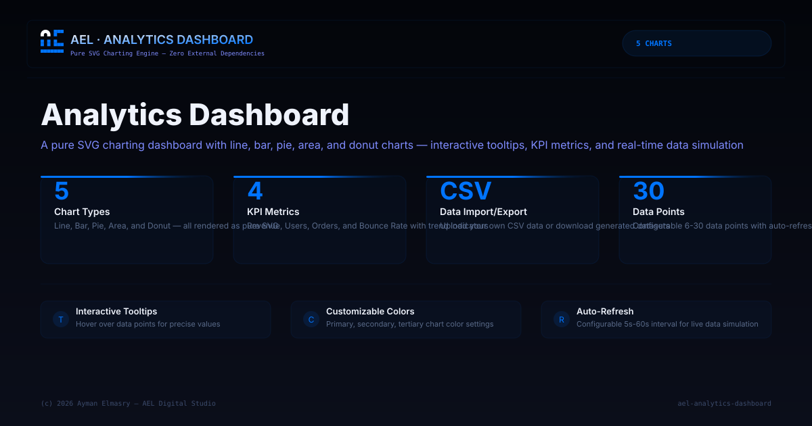

# AEL | Analytics Dashboard — Pure SVG Charting Engine

> **A pure SVG charting dashboard** — zero external dependencies.  
> Generate line, bar, pie, area, and donut charts with interactive tooltips, KPI metrics, and real-time data simulation.  
> Built by Ayman Elmasry — AEL Digital Studio.

---

## Preview



---

## Table of Contents

- [Features](#features)
- [How It Works](#how-it-works)
- [Project Structure](#project-structure)
- [Getting Started](#getting-started)
- [Usage](#usage)
- [Chart Types](#chart-types)
- [Technical Details](#technical-details)
- [Credits](#credits)

---

## Features

- **5 chart types** — Line, Bar, Pie, Area, Donut
- **Pure SVG** — all charts generated as SVG — no Chart.js, D3, or any library
- **KPI cards** — 4 metric cards with trend indicators (Revenue, Users, Orders, Bounce Rate)
- **Interactive tooltips** — hover over data points for details
- **Data table** — view raw data, sort, and explore
- **CSV import/export** — upload your own data or download as CSV
- **Auto-refresh** — configurable refresh interval (5s, 10s, 30s, 60s)
- **Customizable** — chart colors, grid lines, legend visibility
- **Chart demos** — individual chart components with SVG code copy

---

## How It Works

### SVG Chart Generation

Each chart type is rendered as a pure SVG element generated dynamically via JavaScript:

```
Data → SVG Path Generator → DOM SVG Element → Styled Chart
```

| Chart Type | SVG Element | Technique |
|-----------|-------------|-----------|
| **Line** | `<polyline>`, `<circle>` | Smooth curve with data points |
| **Bar** | `<rect>` | Vertical bars with grid lines |
| **Pie** | `<path>` | Segmented arc paths |
| **Area** | `<path>` | Gradient-filled area under line |
| **Donut** | `<path>`, `<circle>` | Segmented arcs with center hole |

### Data Pipeline

1. **Generate** — simulated data with configurable parameters (range, trend, volatility)
2. **Transform** — raw numbers → SVG coordinates via linear scaling functions
3. **Render** — SVG elements are created via DOM API (`createElementNS`)
4. **Interact** — tooltips use SVG mouse events with coordinate mapping

---

## Project Structure

```
ael-analytics-dashboard/
├── index.html                    # HTML5 semantic structure
├── css/
│   └── style.css                 # All styles (glassmorphism, dark theme)
├── js/
│   └── script.js                 # Full JS engine (SVG generation, charts, data, UI)
├── screenshot.svg                # Project preview image
├── .gitignore
└── README.md
```

This separation follows modern web best practices:
- **HTML5** — semantic elements
- **CSS3** — custom properties, Grid layout, animations
- **Vanilla JS (ES2020+)** — SVG DOM generation, data simulation, CSV parser

---

## Getting Started

### Run Locally

```bash
git clone https://github.com/aymanelmasryael/ael-analytics-dashboard.git
cd ael-analytics-dashboard
open index.html
```

Or simply open `index.html` in any modern browser — no server required.

### Prerequisites

- A modern web browser (Chrome, Firefox, Safari, Edge)
- No build tools, no package managers, no server

---

## Usage

### Dashboard
- View KPI metrics (Revenue, Users, Orders, Bounce Rate)
- 4 dashboard charts update with generated data
- Hover over chart elements for tooltips with exact values

### Chart Demos
- Browse individual chart types (Line, Bar, Pie, Area, Donut)
- Copy the SVG code for any chart to use in your own projects

### Data
- Generate new random datasets with different patterns
- Import CSV files with your own data
- Export current data as CSV

### Settings
- Change primary, secondary, and tertiary chart colors
- Toggle animations, grid lines, and legends
- Adjust the number of data points (6–30)
- Set auto-refresh interval for live data simulation

---

## Chart Types

| Type | Description | Best For |
|------|-------------|----------|
| **Line** | Smooth curve with data points and tooltips | Trends over time |
| **Bar** | Vertical bars with grid lines and labels | Comparing categories |
| **Pie** | Segmented circle with percentage tooltips | Part-to-whole relationships |
| **Area** | Gradient-filled area chart | Volume over time |
| **Donut** | Ring chart with center label | Distribution with total |

---

## Technical Details

| Aspect | Detail |
|--------|--------|
| Architecture | Static site (HTML5 + CSS3 + JS) |
| JavaScript | Vanilla ES2020+, SVG DOM API |
| CSS | Custom properties for theming |
| Chart rendering | Pure SVG (no canvas, no external libraries) |
| Data simulation | Built-in random generator with configurable parameters |
| CSV support | Import and export via File API |
| Browser support | Chrome, Firefox, Safari, Edge (modern versions) |

### Performance

- SVG rendering completes in < 50ms for 30 data points
- Tooltip hit detection uses SVG mouse events — no custom math required
- Auto-refresh uses `setInterval` with configurable timing

---

## Credits

**Created by:** Ayman Elmasry — AEL Digital Studio  
**Website:** [aymanelmasry.com](https://aymanelmasry.com)  
**Email:** [info@aymanelmasry.com](mailto:info@aymanelmasry.com)  
**License:** © 2026 Ayman Elmasry — AEL Digital Studio. All rights reserved.

### Connect

[LinkedIn](https://linkedin.com/in/aymanelmasryael) · [Instagram](https://instagram.com/aymanelmasryael) · [X](https://x.com/aymanelmasryael) · [CodePen](https://codepen.io/aymanelmasryael) · [GitHub](https://github.com/aymanelmasryael) · [Behance](https://behance.net/aymanelmasryael)

---

*AEL Prompt IP System v1.0 — Sovereign Identity Block*
